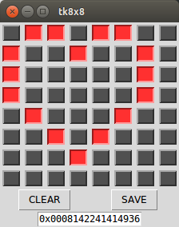

# tk8x8
<br/>
Python 2.7 Tkinter based GUI for interacting with Adafruit 8x8 LED matrices.

# Dependencies
* Adafruit Python Library for LED Backpacks
    * https://github.com/adafruit/Adafruit_Python_LED_Backpack

# Install
Simply clone this repo and run:
```
$ git clone https://github.com/caternuson/tk8x8.git
$ cd tk8x8
$ sudo python tk8x8.py
```
# Configure
Set the I2C address of the LED 8x8 matrix:
```python
I2C_ADDRESS = 0x70
```

Set the LED color by selecting an option from the `LED_COLOR` dictionary:
```python
LED_ON_COLOR = LED_COLOR["red"]
```

Additional color definitions can be added to the `LED_COLOR` dictionary in string
format. However, the syntax must be supported by Tkinter.
The following are some options:
* '#rgb'
* '#rrggbb'
* 'red'

Set the name of the output file created when the **[SAVE]** button is pressed:
```python
TXT_FILE = "led8x8.txt"
```
# X11 Forwarding
If you are accessing the pi remotely via ```ssh```, be sure to enable X11
forwarding with the ```-X``` command line option.

# What's that big hex number on the bottom?
The hex formatted number in the text edit at the bottom is a 64bit value
representing the current bitmap, providing a compact storage scheme.
It can be copy-pasted for use in another project.
To set the 8x8 LED matrix based on a 64bit value simply loop and bit
shift the value, setting individual LEDs per bit. The following code snippet
illustrates this.
```python
def set_raw64(value):
    led8x8matrix.clear()
    for y in xrange(8):
        row_byte = value>>(8*y)
        for x in xrange(8):
            pixel_bit = row_byte>>x&1 
            led8x8matrix.set_pixel(x,y,pixel_bit) 
    led8x8mmatrix.write_display() 
```
